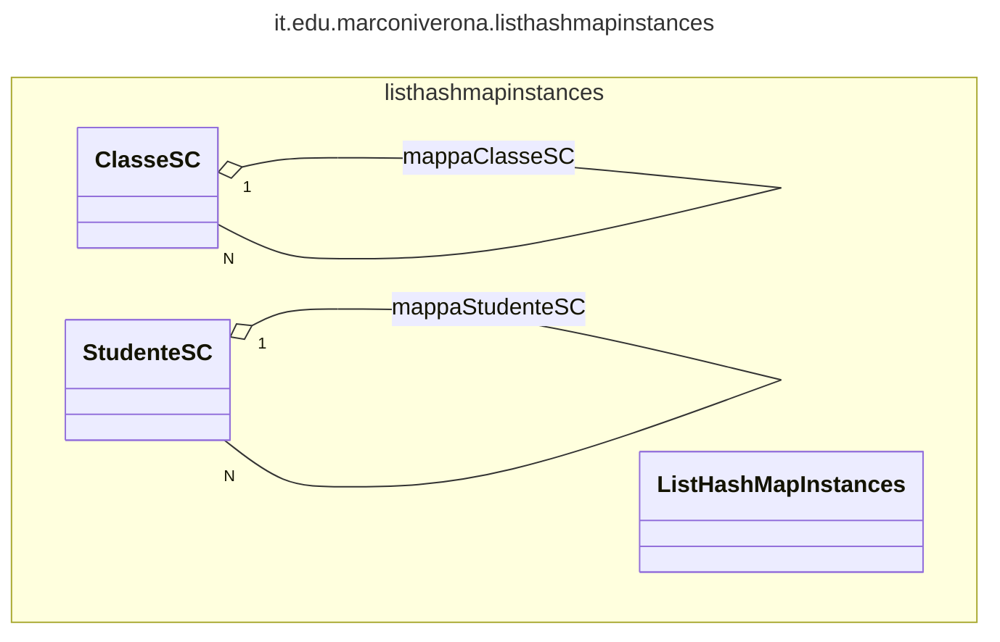
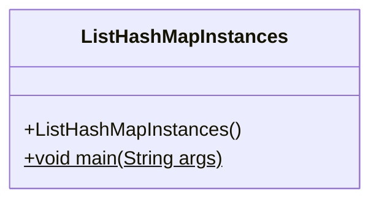
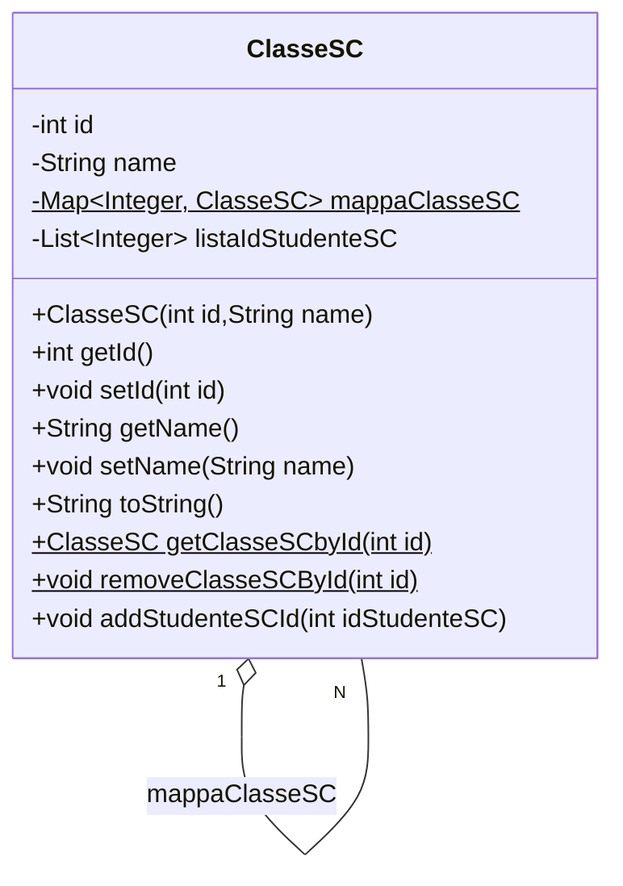
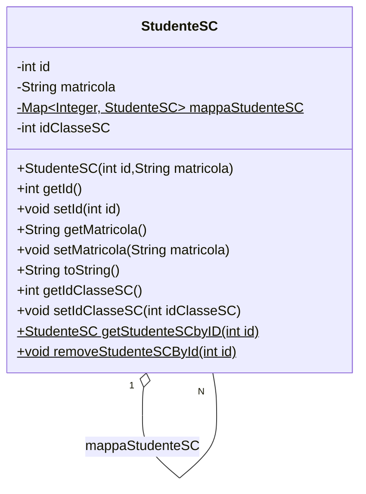

# Gestione di istanze di classi e studenti



Questo progetto Java dimostra l'utilizzo di una struttura dati basata su una mappa per gestire istanze di classi e studenti. Sono fornite tre classi principali:

## ListHashMapInstances.java



Questa classe contiene il metodo principale `main` che illustra l'utilizzo delle istanze di `ClasseSC` e `StudenteSC`. Viene creato un insieme di istanze di entrambe le classi, vengono aggiunti studenti alle classi e vengono visualizzate informazioni sulle classi e sugli studenti.

## ClasseSC.java



Rappresenta un'entità di classe nel sistema. Ogni istanza di questa classe corrisponde a una classe nel sistema e mantiene una lista di ID studente associati ad essa. Alcuni metodi significativi includono:

- `getClasseSCbyId(int id)`: Restituisce un'istanza di `ClasseSC` corrispondente all'ID specificato.
- `removeClasseSCById(int id)`: Rimuove un'istanza di `ClasseSC` corrispondente all'ID specificato.
- `addStudenteSCId(int idStudenteSC)`: Aggiunge un ID studente alla lista di ID studente associati a questa istanza di classe.

## StudenteSC.java



Rappresenta un'entità studente nel sistema. Ogni istanza di questa classe corrisponde a uno studente nel sistema e mantiene un mapping degli ID studente alle istanze studente. Alcuni metodi significativi includono:

- `getStudenteSCbyID(int id)`: Restituisce l'istanza di `StudenteSC` corrispondente all'ID specificato.
- `removeStudenteSCById(int id)`: Rimuove l'istanza di `StudenteSC` corrispondente all'ID specificato.

## Utilizzo

Per utilizzare questo progetto, è sufficiente eseguire la classe `ListHashMapInstances.java`, che contiene il metodo principale. È possibile modificare e aggiungere istanze di classi e studenti a piacimento per testare la funzionalità del codice.

```bash
javac ListHashMapInstances.java
java ListHashMapInstances
```
